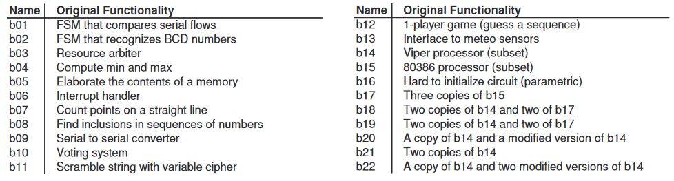
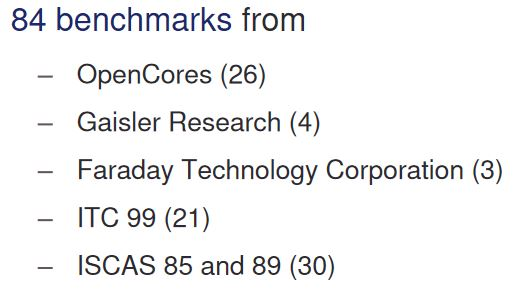

# seq-benchmark
Sequential benchmark circuit collection

## Contents of each benchmark circuit
It is created based on the slide of this [URL](http://iwls.org/iwls2005/benchmark_presentation.pdf).

### ISCAS89


### ITC'99



### IWLS 2005
See the slide at this [URL](http://iwls.org/iwls2005/benchmark_presentation.pdf) for details.


## Reference
- ISCAS 89
```bibtex
@INPROCEEDINGS{100747,  author={F. {Brglez} and D. {Bryan} and K. {Kozminski}},  booktitle={IEEE International Symposium on Circuits and Systems,},   title={Combinational profiles of sequential benchmark circuits},   year={1989},  volume={},  number={},  pages={1929-1934 vol.3},  doi={10.1109/ISCAS.1989.100747}}
```

- ITC'99
```bibtex
@MISC{itc99, title="{ITC'99 Benchmarks}", author="{CAD Group, Politecnico de Torino}", howpublished = "\url{http://www.cad.polito.it/tools/itc99.html}"}
```

- IWLS 2005
```bibtex
@MISC{iwls2005, title="{ IWLS 2005 Benchmarks}", author="{C. {Albrecht}}", howpublished = "\url{http://iwls.org/iwls2005/benchmarks.html}"}
```